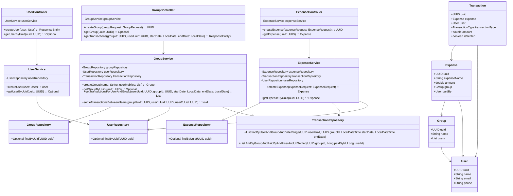

# Documentation

## Overview
This is a demo splitvise project which allows friends to share and manage their expenses.

---

## Build Steps

To build and run this project, you can use Docker Compose. The following steps outline how to set up and start the application using Docker.

**Steps**

1. Ensure Docker is installed on your machine.
2. Navigate to the project directory where the `docker-compose.yml` file is located.
3. Build and start the containers using Docker Compose:

   ```bash
    docker compose up --build
   ```
4. Access the API at http://localhost:8080/api.
5. Stop the containers when you are done:
  ```bash
    docker compose down
  ```

## API Documentation

### Overview
This API allows for the management of users, groups, and expenses. It includes endpoints to create and retrieve users, groups, and expenses, as well as to retrieve transactions associated with a group for a specific user.

### Base URL
http://localhost:8080/api

### 1. **User Management**

#### 1.1 Create a New User
- **Endpoint**: `/users`
- **Method**: `POST`
- **Description**: Creates a new user in the system.
- **Request Body**:
  ```json
  {
    "name": "John Doe",
    "email": "john.doe@example.com",
    "phone": "1234567890"
  }
  ```
- **Response**:
    - Status: 201 Created
    - Body
  ```json
    {
      "userId": "c2df8e22-01ce-44df-b5ed-7feb749e579c"
    }
    ```

#### 1.2 Get a User by UUID

- Endpoint: `/users/{uuid}`
- Method: GET
- Description: Retrieves user details by their UUID.
- Path Parameters:
    - uuid: The UUID of the user.
- Response:
    - Status: 200 OK
    - Body:
      ```json
      {
        "name": "John Doe",
        "email": "john.doe@example.com",
        "phone": "1234567890",
      }
      ```

### 2. **Group Management**

#### 2.1 Create a New Group

- Endpoint: `/groups`
- Method: POST
- Description: Creates a new group with the provided name and users.
- Request Body:
  ```json
  {
    "name": "Friends Group",
    "user_mobiles": ["9835134343", "0987654321"]
  }
  ```
- Response:
    - Status: 200 OK
    - Body:
      ```json
      {
        "uuid": "0168c3a5-c95f-4a1f-b9e8-86944762387e"
      }
      ```

#### 2.2 Get a Group by UUID

- Endpoint: `/groups/{uuid}`
- Method: GET
- Description: Retrieves group details by its UUID.
- Path Parameters:
    - uuid: The UUID of the group.
- Response:
    - Status: 200 OK
    - Body:
      ```json
      {
        "name": "Friends Group",
        "members": ["0168c3a5-c95f-4a1f-b9e8-86944762387e", "2138c5a5-c96f-3a1f-c9e8-76944362387b"]
      }
      ```

#### 2.3 Get Transactions for a Group and User

- Endpoint: `/groups/{groupId}/transactions?userUuid=<uuid>&startDate=<yyyy-mm-dd>&endDate=<yyyy-mm-dd>`
- Method: GET
- Description: Retrieves transactions for a specific group and user within a date range.
- Path Parameters:
    - groupId: The UUID of the group.
- Query Parameters:
    - userUuid: The UUID of the user.
    - startDate: The start date for filtering transactions (ISO format: YYYY-MM-DD).
    - endDate: The end date for filtering transactions (ISO format: YYYY-MM-DD).
- Response:
    - Status: 200 OK
    - Body:
      ```json
      [
        {
          "date": "2024-06-10",
          "group": "Office",
          "expense": "Breakfast @nisarga",
          "total_amount": 100.00,
          "share": "-25.00"
        },
        {
          "date": "2024-06-11",
          "group": "College",
          "expense": "Dinner",
          "total_amount": 500.00,
          "share": "+400.00"
        }
      ]
      ```

#### 2.4 Settle all transactions between 2 users of a group
- Endpoint: `/groups/{groupId}/settle?user1_uuid=<uuid>&user2_uuid=<uuid>`
- Method: POST
- Description: Settles all transactions between two users in a specific group. All transactions where User1 paid for User2 will be marked as settled, and all transactions where User2 paid for User1 will also be marked as settled.
- Path Parameters:
- group_id: The UUID of the group.

### 3. **Expense Management**

#### 3.1 Create a New Expense

- Endpoint: `/expense`
- Method: POST
- Description: Creates a new expense within a group.
- Request Body:
  ```json
  {
    "group_id": "0168c3a5-c95f-4a1f-b9e8-86944762387e",
    "expense_name": "Dinner",
    "total_amount": 120.00,
    "split_type": "EQUAL",
    "paid_by": "c2df8e22-01ce-44df-b5ed-7feb749e579c",
    "split_breakup": [
      {
        "user_uuid": "c2df8e22-01ce-44df-b5ed-7feb749e579c"
      },
      {
        "user_uuid": "3b7d7f29-8d0b-4b9b-a254-3414d6783cb8"
      }
    ]
  }
  ```
- Response:
    - Status: 200 OK
    - Body:
      ```json
      {
        "uuid": "5e89c2e9-92f8-4d17-9d59-01d1245d7c72"
      }
      ```

#### 3.2 Get an Expense by UUID

- Endpoint: `/expense/{uuid}`
- Method: GET
- Description: Retrieves expense details by its UUID.
- Path Parameters:
    - uuid: The UUID of the expense.
- Response:
    - Status: 200 OK
    - Body:
      ```json
      {
        "uuid": "5e89c2e9-92f8-4d17-9d59-01d1245d7c72",
        "expense_name": "Dinner"
      }
      ```
---

## Class Diagram
